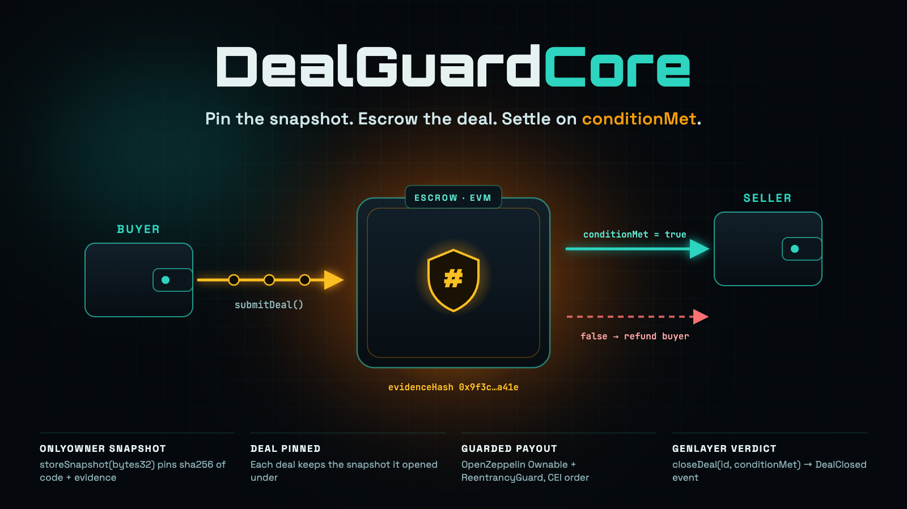
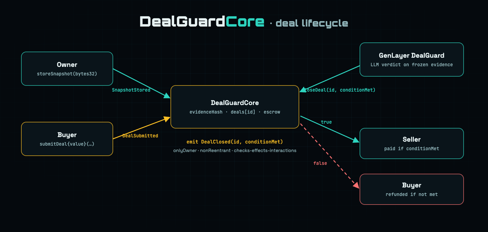

# DealGuardCore

<p align="center">
  
</p>

<p align="center">
  <strong>EVM settlement layer for <a href="https://github.com/valentinzubok/DealGuard">DealGuard</a>: pin a code/evidence snapshot, escrow the deal, settle on <code>conditionMet</code>.</strong>
</p>

<p align="center">
  <a href="https://github.com/valentinzubok/DealGuardCore/actions/workflows/ci.yml"></a>
  
  
  
  <a href="LICENSE"></a>
</p>

---

## Why

[DealGuard](https://github.com/valentinzubok/DealGuard) runs on GenLayer: validators freeze listing and delivery pages, then LLMs
judge the **frozen** evidence. DealGuardCore takes that verdict to any EVM chain:

1. The owner pins a **snapshot hash** (`evidenceHash`), for example sha256 of git HEAD plus the contract source.
2. A buyer opens a deal and **escrows** the amount. The deal records the snapshot it opened under.
3. The owner relays GenLayer's verdict with `closeDeal(id, conditionMet)`. If the condition is met, the seller is paid. Otherwise, the buyer is refunded.

<p align="center">
  
</p>

## Contract API

| Function | Access | What it does |
|---|---|---|
| `storeSnapshot(bytes32 hash)` | `onlyOwner` | Replace the pinned `evidenceHash`, emits `SnapshotStored(previous, new)` |
| `submitDeal(address buyer, address seller, uint256 amount)` | buyer, `payable` | Escrow exactly `amount` wei, pin current `evidenceHash`, returns `id`, emits `DealSubmitted` |
| `closeDeal(uint256 id, bool conditionMet)` | `onlyOwner`, `nonReentrant` | Pay seller (`true`) or refund buyer (`false`), emits `DealClosed(id, conditionMet)` |
| `getDeal(uint256 id)` | view | `buyer, seller, amount, evidenceHash, openedAt, closed, conditionMet` |
| `evidenceHash()` · `dealCount()` · `owner()` | view | Current snapshot, number of deals, owner |

**Events:** `SnapshotStored(bytes32 indexed previousHash, bytes32 indexed newHash)` ·
`DealSubmitted(uint256 indexed id, address indexed buyer, address indexed seller, uint256 amount, bytes32 evidenceHash)` ·
`DealClosed(uint256 indexed id, bool conditionMet)`

### Security properties

- **OpenZeppelin `Ownable`**: only the owner can change the snapshot or close deals.
- **OpenZeppelin `ReentrancyGuard`** on `submitDeal` and `closeDeal`. The payout follows checks-effects-interactions: the deal is marked closed before any ETH moves.
- **Snapshot pinning**: a later `storeSnapshot` never rewrites the snapshot of an open deal.
- **Failed payouts roll back**: if the payee rejects ETH, `closeDeal` reverts and the deal stays open.
- **Custom errors** for every rejected input (`WrongValue`, `SameParty`, `NoSnapshot`, `AlreadyClosed`, …).

## Getting started

```bash
git clone --recursive https://github.com/valentinzubok/DealGuardCore.git
cd DealGuardCore
forge build
forge test -vvv
```

The 12 tests include fuzzing (funds are conserved for every amount and verdict), a reentrancy attempt during the payout, and a failed-payout rollback.

### Deploy

```bash
OWNER=0xYourRelayer EVIDENCE_HASH=0x<sha256 of CODE_SNAPSHOT> \
forge script script/Deploy.s.sol --rpc-url $RPC_URL --private-key $PRIVATE_KEY --broadcast
```

`EVIDENCE_HASH` can be the `evidence_hash` from DealGuard's
[`CODE_SNAPSHOT.json`](https://github.com/valentinzubok/DealGuard/blob/main/CODE_SNAPSHOT.json), so both chains point at the same code.

## Layout

```
src/DealGuardCore.sol        contract
test/DealGuardCore.t.sol     Foundry tests (unit + fuzz + reentrancy)
script/Deploy.s.sol          deploy script
assets/                      README art
```

## Related

- [DealGuard](https://github.com/valentinzubok/DealGuard): GenLayer intelligent contract (frozen evidence + LLM adjudication), live on Studio Dev 61997
- [ReputationStake](https://github.com/valentinzubok/ReputationStake): validator reputation staking

## License

[MIT](LICENSE) © 2026 Valentyn Zubok
